# 项目概述
目前，新`PluginHub`现在是一份加速`Unity3D`项目开发的代码模板。包含`Runtime`(运行时)和`Editor`(编辑器)功能。

`Runtime`主要由以下功能组成：

1. 一个名为[Debugger](#Debugger)的运行时GUI覆盖层。拥有运行时查看控制台日志的功能，并能够查看基本信息和一些杂项功能。也允许您为其添加特定于应用的GUI。
这在制作程序后台管理页面时特别有用。该覆盖层还拥有快捷键和手势呼出隐藏功能。
2. Unity中实现的单例类
3. 位于Extends目录下的系统类扩展，添加很多实用的功能
4. 相机移动组件，提供运行时编辑器风格的相机移动控制、地图风格的相机控制、和第三视角的相机控制。
5. 其余小工具类，部分搜集于网络，部分自己开发。都是觉得特别有用的。

`Editor`部分就是PluginHub编辑器窗口：

它提供了编辑器内的辅助工具，用于加速开发。同时也是一款用`IMGUI`编写、基于`EditorWindow`的`Unity3D`编辑器插件开发框架。您可以使用这些开发完成的插件模块提高您的工作效率。或者您也可以自己开发插件模块，以适应您自己的开发工作流。  
`PluginHub`编辑器功能在`Unity3D`中以`PluginHub`窗口的形式呈现，您可以在窗口中查看和使用所有模块的功能，也可以在`PluginHub`配置文件中启用或禁用模块。

感谢您点击页面右上角的`Star`以支持我的工作。若您发现`PluginHub`中的任何问题，欢迎提交`Issue`或`Pull Request`。  

`PluginHub` 目前处于非常前期的阶段，很多实用的功能正在开发也需要时间验证。如果您发现报错，不用怀疑，那就是bug。请提交Issue，我会尽快修复。

中文视频说明：https://www.bilibili.com/video/BV1H94y1a79d/

## 动态
2024年4月30日：大更新，添加了运行时代码库，丰富了`PluginHub`的功能。文档正在完善，或者也可以直接阅读源码。  
2024年4月26日：现在尽量将类似功能的模块合并，以减少模块数量。

## 安装与使用

已经过测试的`Unity3D`版本：`2021.3.x` 以上。更老的版本可能也可以使用，但是未经测试，可能会有API不兼容的情况。

随着功能增加和框架变更，之前的旧模块可能会出现问题，目前还在积极开发中。任何使用问题请提交`Issue`。

1. 将存储库克隆到本地
2. 在`Unity3D`中打开`Package Manager`窗口
3. 点击`+`按钮，选择`Add package from disk...`
4. 选择`PluginHub`文件夹中的`package.json`文件
5. 等待`Unity3D`导入完成
6. 导航到`Window`->`PluginHub` 或者 `Ctrl+Alt+R`打开`PluginHubWindow`窗口
7. 在`PluginHubWindow`窗口中展开模块的下拉卷展栏
8. 开始使用
9. 如果想要定制您的`PluginHubWindow`，请导航到`PluginHub\Resources\PH_ModuleConfigSO.asset`，在检视面板中启用或禁用模块

## PluginHub主窗口、模块配置页面
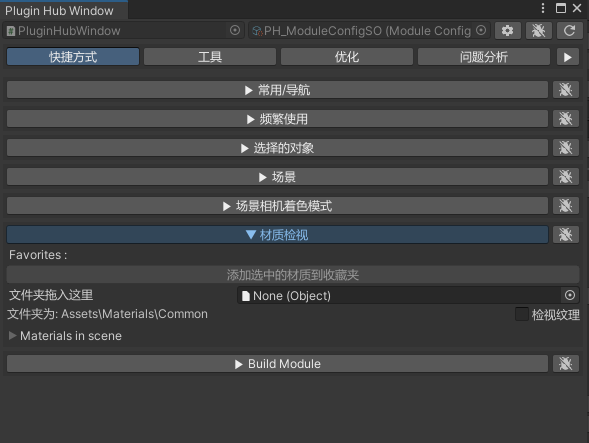
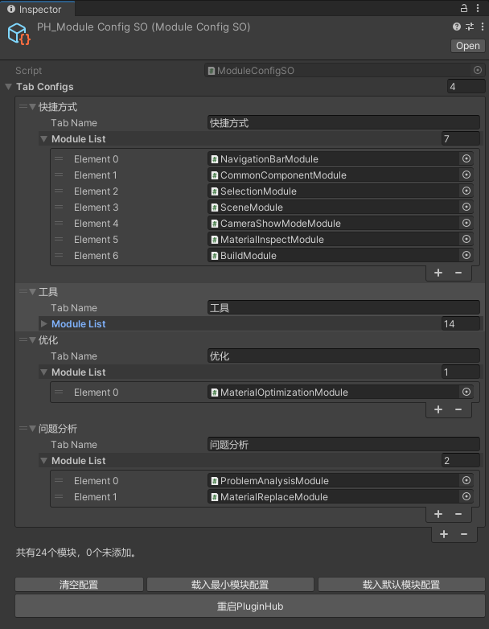

## 名词

- `PluginHubWindow`：一个Unity3D编辑器窗口，所有插件模块`UI`都在这个窗口中呈现（见`PluginHubWindow`类）。打开`PluginHubWindow`的快捷键是`Ctrl+Alt+R`
- 插件模块：对应`PluginHubWindow`中的每个下拉卷展栏，实现一个方面的功能。也称作`Module`，基类为`PluginHubModuleBase`
- `ModuleConfigSO`:一个`ScriptableObject`配置文件，用于配置您需要启用的模块，启用的模块会在`PluginHubWindow`中显示。见`ModuleConfigSO`类
- `PH`:有时候您可能会在源码中看到`PH`这个缩写，它是`PluginHub`的缩写

## 特点

- 模块之间分类清晰，简单易用。可以通过每个模块的卷展栏按钮折叠和展开模块。
- 提供多种方便的模块功能，您也可以开发自己的模块，只需继承`PluginHubModuleBase`类即可。
- 可以通过`ScriptableObject`配置文件启用或禁用模块，以定制您干净整洁的`PluginHubWindow`。
- 包含完整源代码，您可以自由扩展和修改功能模块。

## 代码目录结构
`Scripts\Runtime\Debugger` 一个名为`Debugger`的`GUI`覆盖层，详细见见下文。
`Scripts\Runtime\Extends` 运行时系统类扩展
`Scripts\Runtime\Manager` 各种单例类，实现各方面功能
`Scripts\Runtime\Tools` 小功能工具类
`Scripts\Runtime\Tools\CameraMovement` 相机移动组件，挂到相机上即可使用
`Scripts\Editor\Extends` 编辑器系统类扩展
`Scripts\Editor\Helper` 些辅助类,常用的助手函数
`Scripts\Editor\Module` 所有继承自`PluginHubModuleBase`的模块入口类,在`PluginHubWindow`中展示一套GUI  
`Scripts\Editor\Module\ModuleScripts` 如果模块过于复杂(无法在一个文件中写完)，可以将模块的脚本放在这个目录下  
`Scripts\Editor\MenuExtends` 菜单扩展  

# 已完成开发的编辑器窗口模块
这里只介绍一些常用和功能强大，且成熟稳定的模块，更多模块请自行查看源码。

### NavigationBarModule

将常用的窗口，Unity文件夹，个人文件夹做成按钮便于访问。

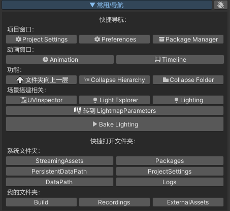

### CommonComponentModule

将场景中经常使用的、重要的`GameObject`统一到一个窗口中，方便您随时选择他们。  
也能自动为您选择距离场景相机最近的`GameObject`。

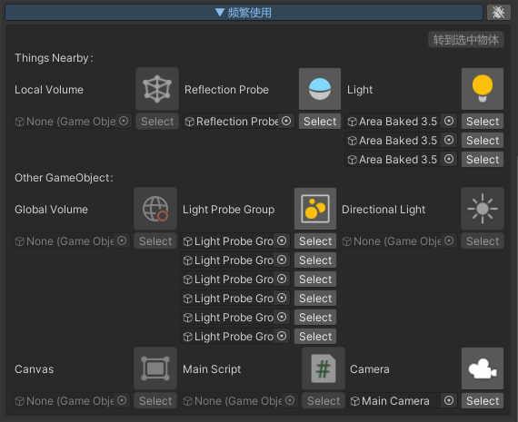

### BuildModule
模块评星:⭐⭐⭐⭐⭐  
为用户提供一键打包功能，支持多平台。为我项目迭代节省了大量时间。  
构建项目：与`PlayerSettings`中的构建按钮功能相同。  
构建当前场景：与构建项目类似，区别是`exe`执行文件和打包目录使用当前场景名称命名。  
仅构建当前场景：程序会先在构建设置中取消勾选其他场景，只保留当前场景，以仅将当前场景打进包中，并且`exe`执行文件和打包目录使用当前场景名称命名。（也可指定其他名称）  

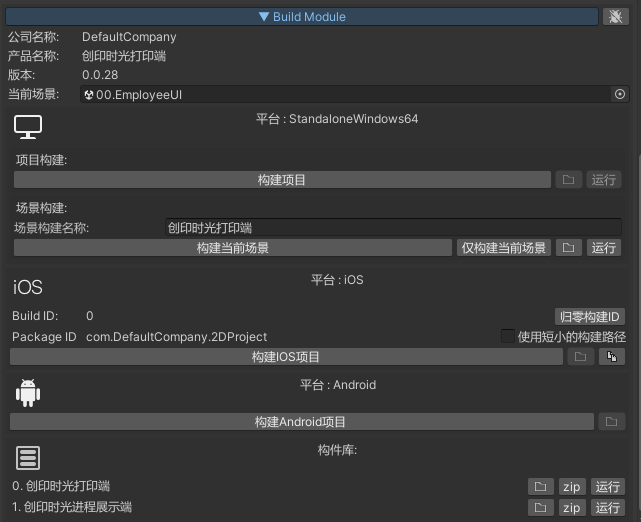

### SceneModule
模块评星:⭐⭐⭐⭐  
能够在一个位置查看项目中的所有场景资产，并可以进行过滤筛选。例如您可以输入`Main`来查找所有文件名中包含`Main`的场景。  
方便用户快速定位到场景资产。

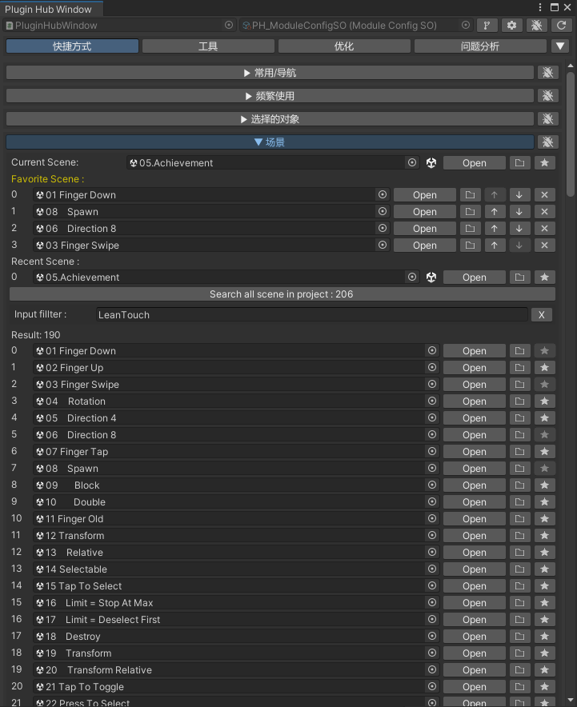

### SelectionModule

功能围绕选中的`Object`展开。展示与选中的`Object`相关的数据。

例如：如果选中的是场景中的`Mesh`对象，模块会在场景视图中展示长宽高的数据。

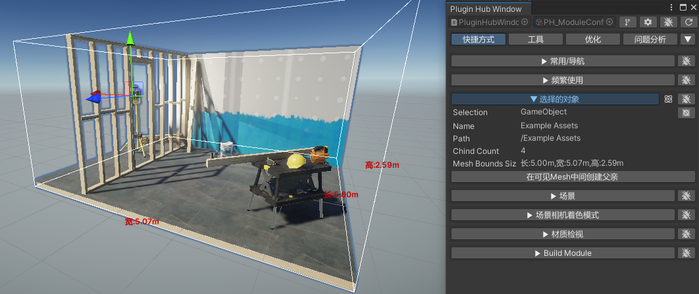

### ShaderDebuggerModule

可以用该模块吸取场景中的颜色值，颜色值能够以`0-1`的浮点数和`0-255`的整数两种形式显示。便于Shader调试。

### ReferenceFinderModule

引用查找和替换。

一个使用场景是，您制作了一个新材质，想要将项目中所有使用旧材质的物体替换为新材质。

另一个使用场景，您想要查找项目中所有使用了某个`Shader`的物体。或者您想要知道自己是否可以安全的删除某个`Shader`。以排除是否有其他资产依赖于该`Shader`。

### AlignModule

想要将场景中的物体对齐到某个物体上？这个模块可以帮助您。

例如将灯模型对齐天花板，将桌子模型对齐到地面。

也可以以指定的距离和方向移动物体。

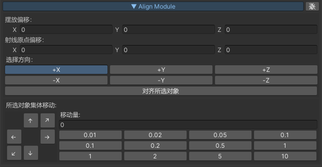

### TextureModule

进行简单的图像处理。  
在URP或HDRP中，通常材质要求使用一张纹理的多个通道来提供不同的信息。例如：HDRP中金属度和光滑度使用同一张纹理的不同通道来提供。  
这时候您可以使用该模块将两张纹理中指定的通道合并到一张纹理的不同通道。  
又例如您在第三方网站下载资产时下载到的是Roughness纹理，但是Unity通常需要的是Smoothness纹理，这时候您可以使用该模块将Roughness纹理转换为Smoothness纹理。（Roughness=1-Smoothness）  

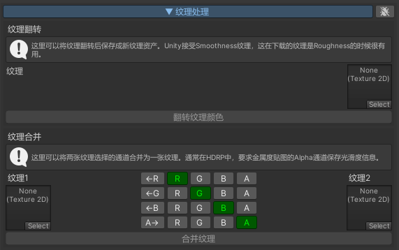

### LightProbePlacementModule

程序化控制LightProbe的放置，节约您的时间。

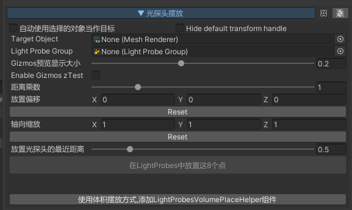

### MaterialToolsModule
模块评星:⭐⭐⭐⭐⭐  
提供众多材质功能:  
1. 由于在3Dmax中的不当操作,可能会引起材质使用不规范,相同材质有多个实例  
此模块提供能够搜索场景中名称相同、主纹理相同、名称相似的材质，为减少DrawCall的后续操作提供参考。也能一键帮您完成替换  
2. 提供将场景中所有对旧材质的引用替换为新材质。  

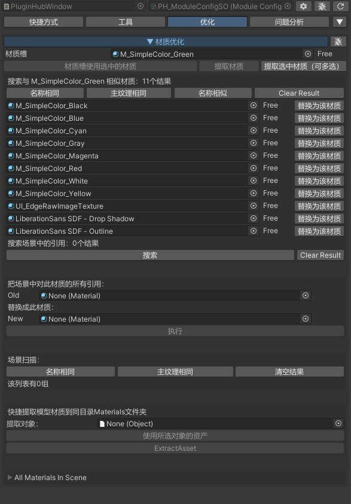

### MaterialReplaceModule

使用给定材质替换场景中所有材质。不会破坏场景，可以随时还原。    
多用于使用棋盘格纹理替换场景,用于观察UV密度是否合理

### SceneViewContextMenu

该模块为场景视图添加右键菜单  

在右键菜单中有以下功能:  
1. 我实现了类似`UE`中移动场景相机到鼠标位置的功能,只需右键点击场景视图想要到达的位置,然后在弹出的菜单中选择`Go To Mouse Pos`即可将场景相机移动到鼠标位置  
该功能不依赖碰撞器,可以在所有Mesh上使用,如果场景过于复杂,计算碰撞可能需要数秒时间.
2. 移动选中物体到鼠标位置,只需右键点击场景视图想要的位置,然后在弹出的菜单中选择`Move Selection To Here`即可将选中的物体移动到鼠标位置  
3. 选中鼠标位置处的材质,只需右键点击场景中的网格物体,然后在弹出的菜单中选择`The Material Here`即可选中鼠标位置处的材质。这在Mesh具有多个材质时可以快速定位到材质资产。  

# Debugger

`Debugger`属于运行时功能

一个名为`Debugger`的运行时`GUI`覆盖层。拥有运行时查看控制台日志的功能，并提供修改和查看`Unity`常用信息和设置的`GUI`。
`Custom Window`允许您为其添加特定于应用的`GUI`。只需让您的`MonoBehaviour`继承`Debugger.CustomWindow.ICustomWindowGUI`接口即可。
这在制作程序后台管理页面时特别有用。该覆盖层还拥有快捷键和手势呼出隐藏功能，使用 \` 按钮呼出和隐藏`Debugger`，
无键盘的移动设备可以使用手指触摸屏幕画圈的方式进行呼出和隐藏。
`Debugger`GUI的优势在于它使用与代码紧密结合的`IMGUI`来编写，因此它可以很容易地与您的代码集成。编写效率极高。

下面的图片展示了在多种互动软件中`Debugger`的`Custom`页面展示效果

其中包含了：

- 一款串口通信软件
- 一款联机赛车互动游戏

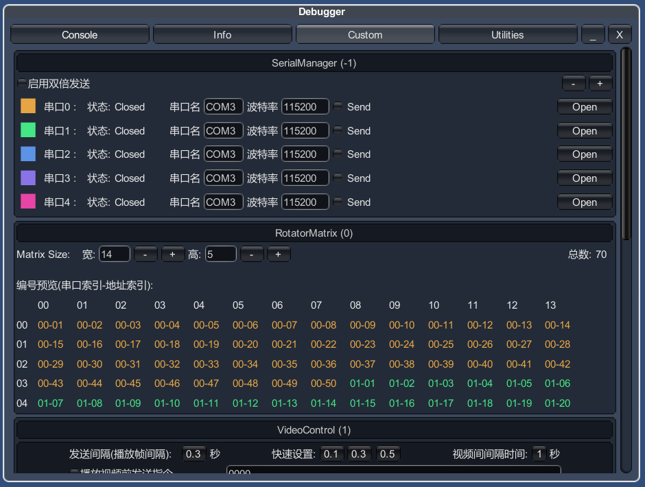
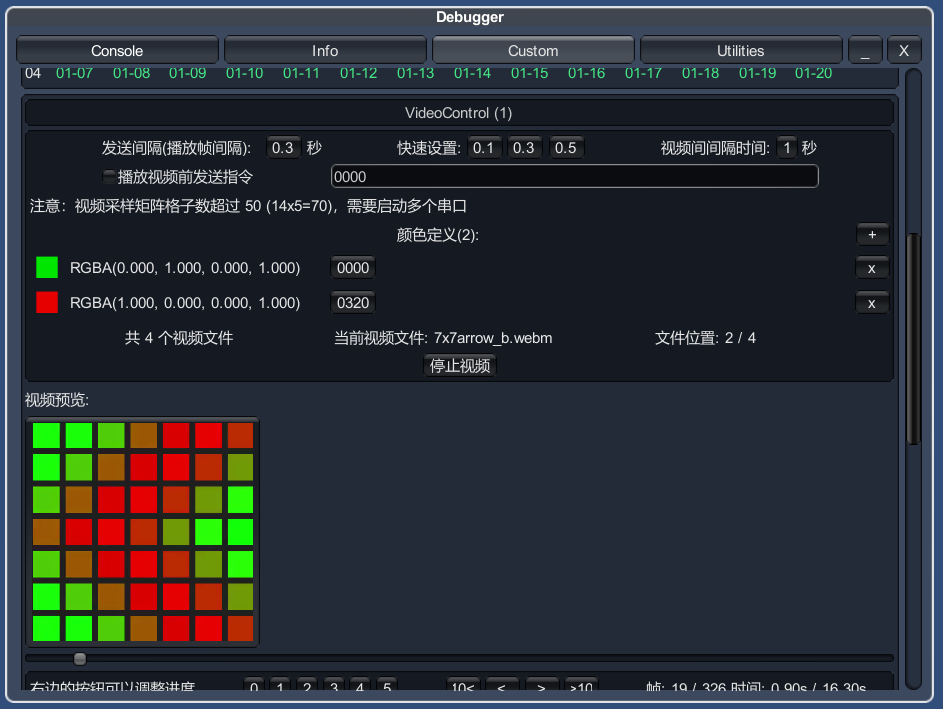
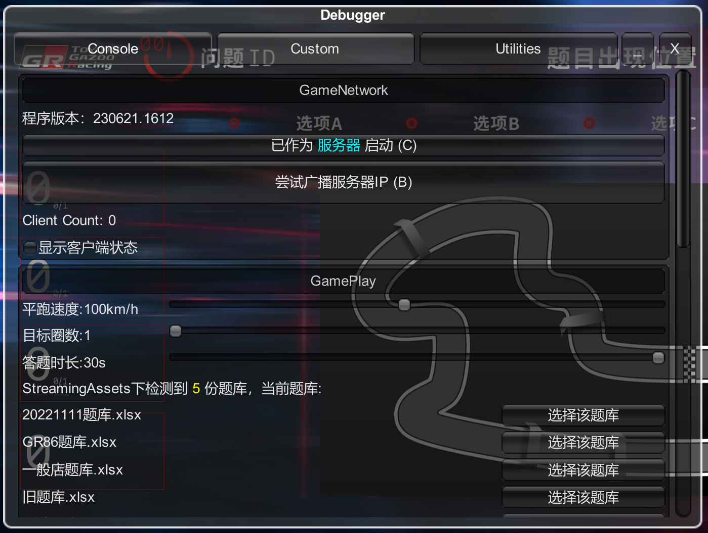
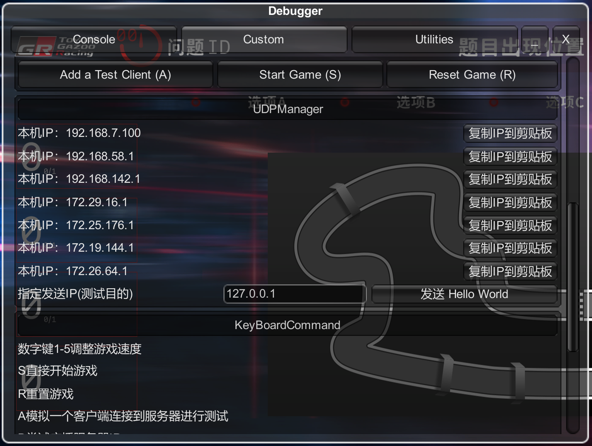

下面的图片展示了`Debugger`其他页面基础功能

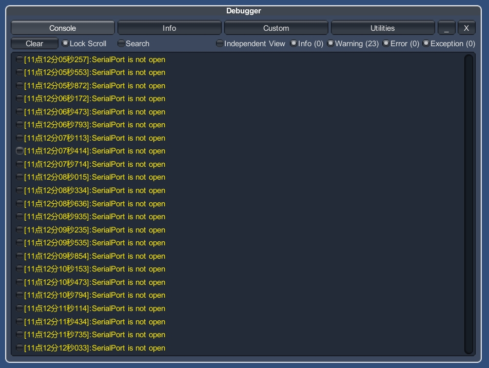
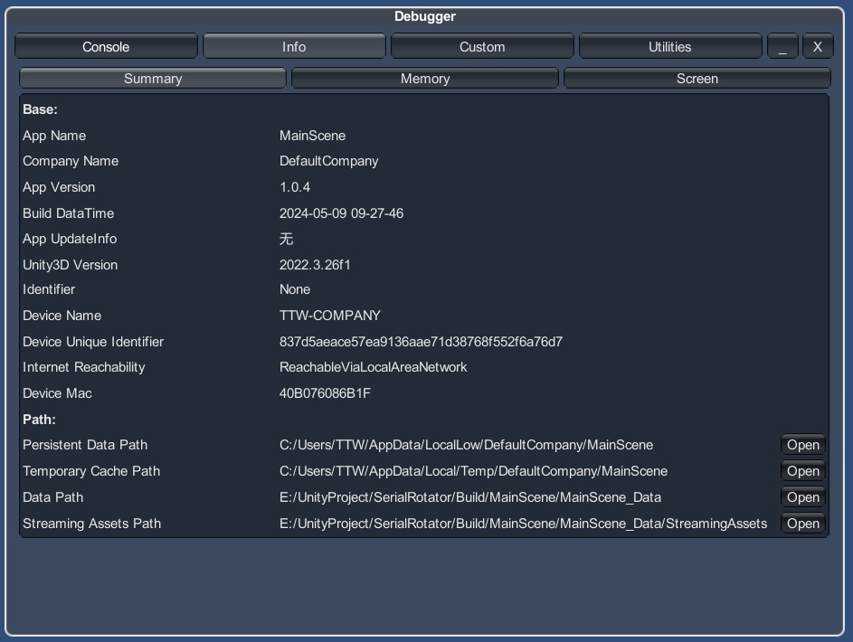
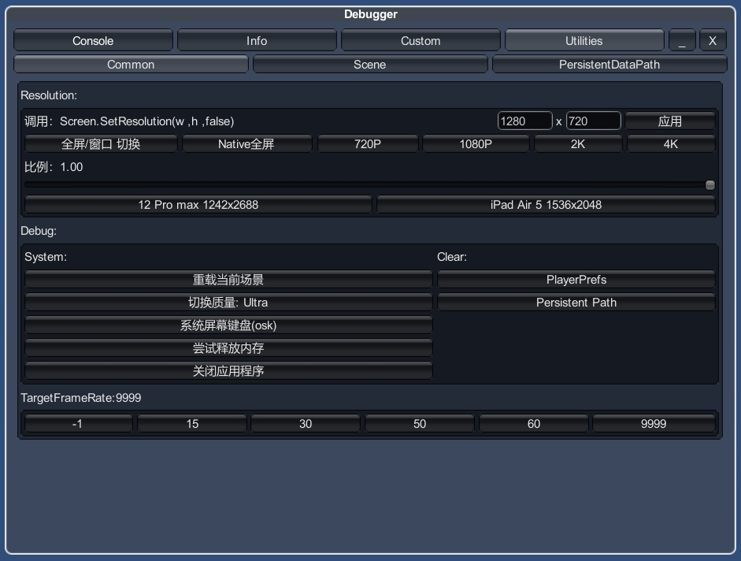

# 感谢
该项目使用`JetBrains`的`Rider`作为开发工具，感谢`JetBrains`提供的[开源许可证](https://jb.gg/OpenSourceSupport)。  
  
