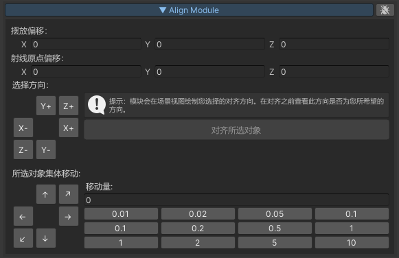

# 项目介绍
`PluginHub`是一款`Unity3D`编辑器插件开发框架，并包含了一些已开发完成的插件模块。
每个模块实现一个方面的功能。旨在为您提供各式各样的功能，以加速开发效率。

PluginHub is a Unity3D editor plugin development framework, and contains some developed plugin modules.

`PluginHub`在`Unity3D`中以`PluginHub`窗口的形式呈现，您可以在窗口中查看和使用所有模块的功能，也可以在`PluginHub`配置文件中启用或禁用模块。

## 名词

- `PluginHubWindow`：一个Unity3D编辑器窗口，所有插件模块`UI`都在这个窗口中。见`PluginHubWindow`类。打开`PluginHubWindow`的快捷键是`Ctrl+Shift+R`
- 插件模块：对应`PluginHubWindow`中的一个下拉卷展栏，实现一个方面的功能。也称作`Module`，基类为`PluginHubModuleBase`
- `ModuleConfigSO`:一个`ScriptableObject`配置文件，用于配置您需要启用的模块。见`ModuleConfigSO`类

## 特点

- 模块之间分类清晰，简单易用
- 提供多种方便的模块功能，您也可以开发自己的模块，只需继承`PluginHubModuleBase`类即可。
- 可以通过`ScriptableObject`配置文件启用或禁用模块，以定制您干净整洁的`PluginHubWindow`。
- 包含完整源代码，您可以自由扩展和修改功能模块。

## 已完成开发的模块
这里只介绍一些常用且成熟稳定的模块，更多模块请自行查看源码。

### CommonComponentModule

将场景中经常使用的、重要的`GameObject`统一到一个窗口中，方便您随时选择他们。也能根据场景相机的位置自动为您选择最近的`GameObject`。

### BuildModule

为用户提供一键打包功能，支持多平台。

构建项目：与`PlayerSettings`中的构建按钮功能相同。

构建当前场景：与构建项目类似，区别是`exe`执行文件和打包目录使用当前场景名称命名。

仅构建当前场景：程序会先在构建设置中取消勾选其他场景，只保留当前场景，以仅将当前场景打进包中，并且`exe`执行文件和打包目录使用当前场景名称命名。（也可指定其他名称）

### SceneModule

可以查看项目中的所有场景资产，并可以进行过滤筛选。例如您可以输入`Main`来查找所有文件名中包含`Main`的场景。
方便用户快速定位到场景资产。

### SelectionModule

功能围绕选中的`Object`展开。

例如：如果选中的是场景中的`Mesh`对象，模块会在场景视图中展示长宽高的数据。

### ShaderDebuggerModule

可以用该模块吸取场景中的颜色值，颜色值能够以`0-1`的浮点数和`0-255`的整数两种形式显示。便于Shader调试。

### ReferenceFinderModule

引用查找和替换。

一个使用场景是，您制作了一个新材质，想要将项目中所有使用旧材质的物体替换为新材质。

另一个使用场景，您想要查找项目中所有使用了某个`Shader`的物体。或者您想要知道自己是否可以安全的删除某个`Shader`。

### AlignModule

想要将场景中的物体对齐到某个物体上？这个模块可以帮助您。

例如将灯模型对齐天花板，将桌子模型对齐到地面。

也可以以指定的距离和方向移动物体。

### TextureProcessModule

在URP或HDRP中，通常材质要求使用一张纹理的多个通道来提供不同的信息。例如：HDRP中金属度和光滑度使用同一张纹理的不同通道来提供。

这时候您可以使用该模块将两张纹理中指定的通道合并为一张纹理。

又例如您下载到的是Roughness纹理，但是Unity通常需要的是Smoothness纹理，这时候您可以使用该模块将Roughness纹理转换为Smoothness纹理。（Roughness=1-Smoothness）

### LightProbePlacementModule

程序化控制LightProbe的放置，节约您的时间。

### MaterialOptimizationModule

快速提取嵌入式材质

以名称相同、主纹理相同、名称相似的条件搜索场景中类似的材质，为您减少DrawCall的后续操作提供参考。

将场景中所有对旧材质的引用替换为新材质。

### MaterialReplaceModule

使用给定材质替换场景中所有材质。不会破坏场景，可以随时还原。

### MeshToHeightModule

模块会用竖直向下投射射线的方式，将任意Mesh转换为HeightMap，可用于生成地形图等场景。